# Yomime

Yomime is an Android app for reading Japanese manga. It uses files already stored on your device, detects text on the page with the reader's built-in OCR, and shows the lookup result in a sheet over the current page. You do not have to switch apps or type kanji you do not know yet.

The app is designed to work offline. Your manga stays local, the dictionary stays local, and OCR runs on the device. AniList is optional: if you connect it, your progress syncs, or you can skip it, and all other features still work.

**[Download the APK](https://github.com/NOPNOP0F/yomime-releases/releases/latest)** - Requires Android 8.0 or newer. The current version is 1.0.0-beta.

<https://github.com/user-attachments/assets/4d65a169-3d2f-49d2-a089-0e73a0ac8fb1>

## Reader

Choose a folder on your device, and the app locates your manga. It identifies volumes and chapters from names you already use, such as `Chapter 1`, `Vol. 3`, `第01巻`, `第一巻`. A Detection Guide screen in the app shows exactly what is matched and what is not, so you do not have to guess.

The reader itself basically an image viewer with some features:

- Reading direction can be right-to-left or left-to-right, either globally or overridden for a specific title.
- Two-page spread in landscape mode. It looks especially good on tablets.
- Tap zones for turning pages.
- Page slider, clickable thumbnails, jump-to-page, brightness control, and keep-awake option.
- Your reading position is saved for each release.

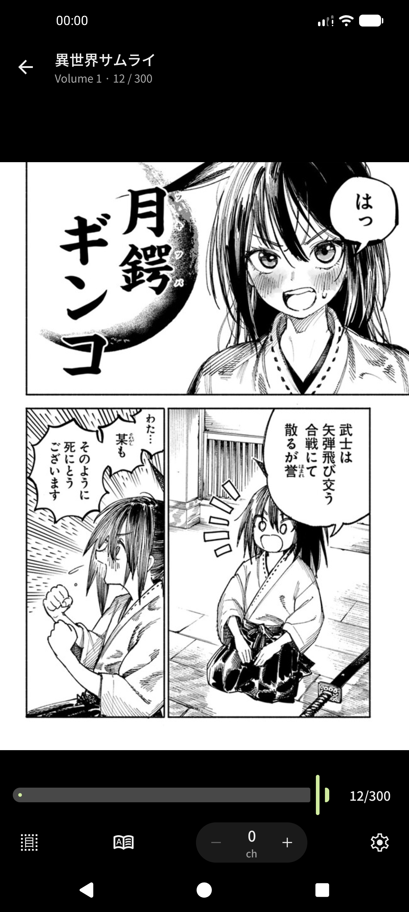 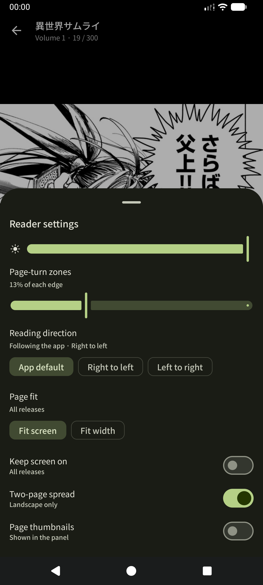

## Look up

Press the OCR button and a reticle appears over the page. Drag its edges around the words or kanji you don't know, then tap Scan. The crop takes zoom, pan, fit, and reading direction into account, so the area you framed is the area that gets read.
The recognized text is sent directly to the dictionary, and the lookup sheet opens over the page.

## Dictionary

JMdict and KANJIDIC can be installed from inside the app in the languages you choose, including English, German, Russian, Spanish, French, and others. After that, you never need to go online again for them.

- Search by kanji, kana, or romaji. Kana input matches either script.
- Senses are grouped by language and include part of speech, field and dialect tags, form restrictions, see-also notes, and antonym notes.
- Kanji pages show stroke count, grade, JLPT level, frequency rank, on-yomi, kun-yomi, nanori, variants, and the words that use them.
- Furigana is shown throughout, with optional romaji.
- History records what you searched and what you opened, so yesterday's unknown word is only one tap away.
- Tap a headword or kanji to copy it.

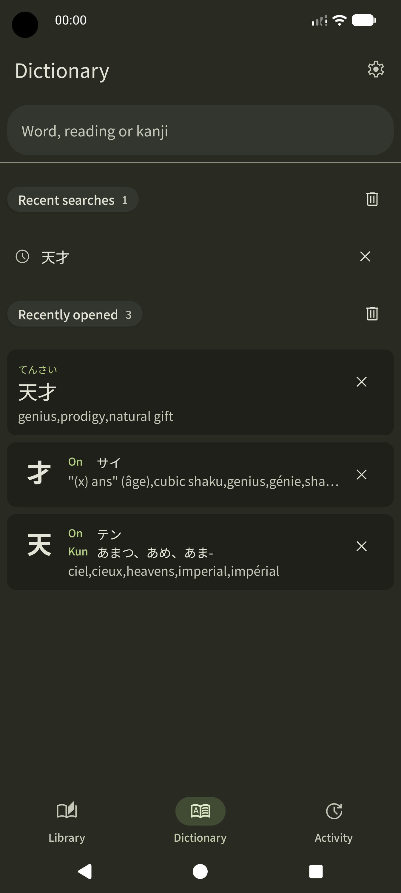 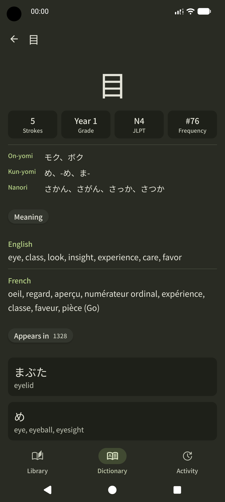 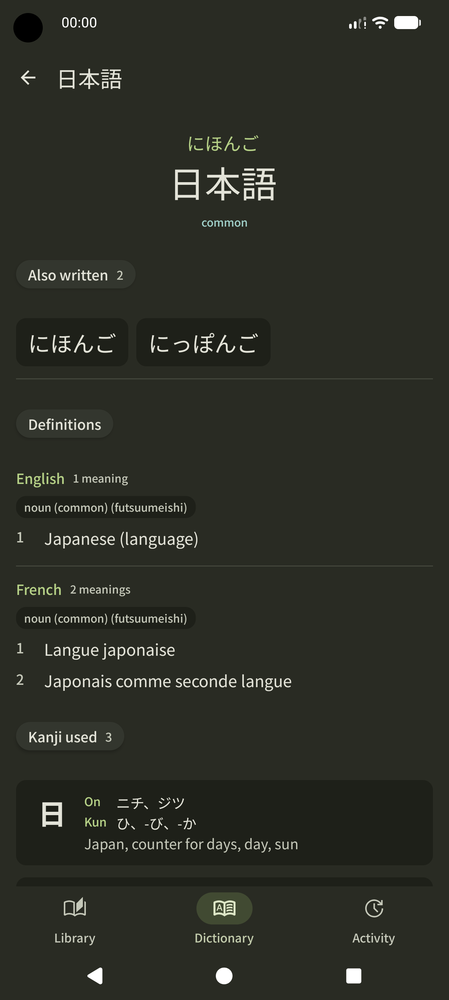

## Track

When you connect AniList, your local folders are matched to real entries, so your library becomes one list instead of two.

- A chapter counter in the reader lets you mark one chapter per tap, with undo.
- A full list entry editor for status, progress, volumes, score, dates, repeats, and notes.
- Edits made offline are queued and flush automatically when you are back online.
- An Activity tab shows the queue and log. It marks items as queued, syncing, synced, or failed, and explains why a failure occurred.
- Media pages include synopsis, tags, related works, scores, and ranks.

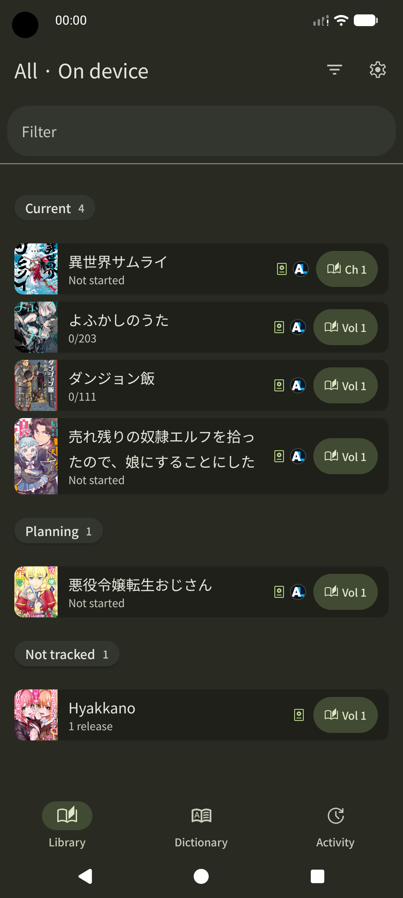 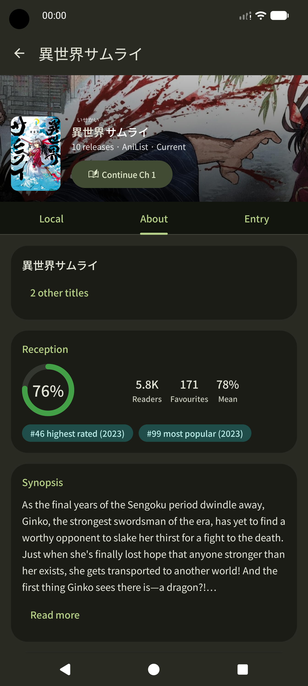 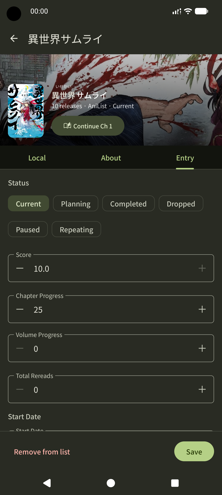 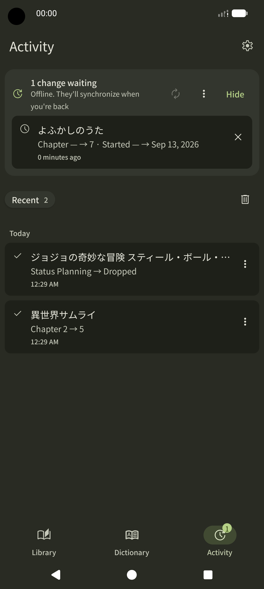

## Look

The app uses Material 3, with four themes across three color schemes. The layout adapts to the screen: on tablets, foldables, the library, dictionary, and activity screens split into two panes.

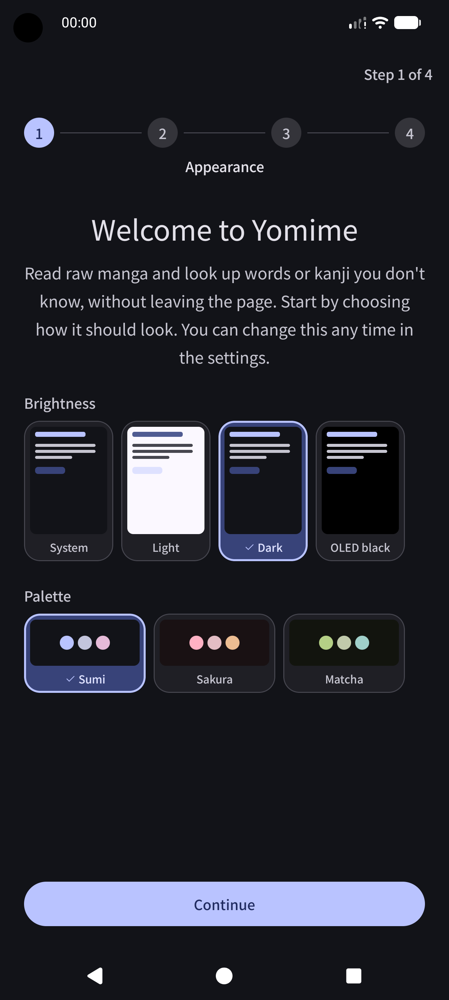 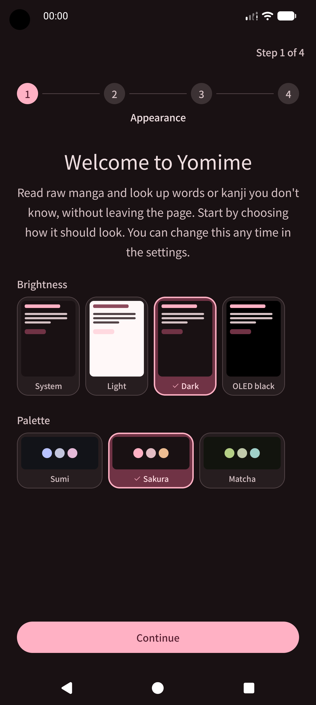 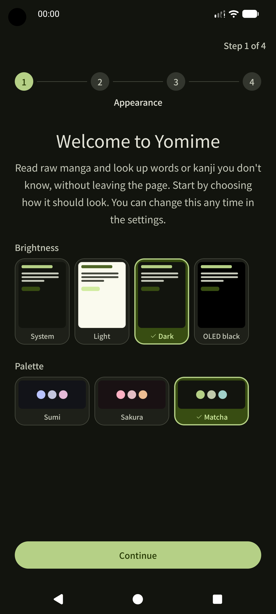

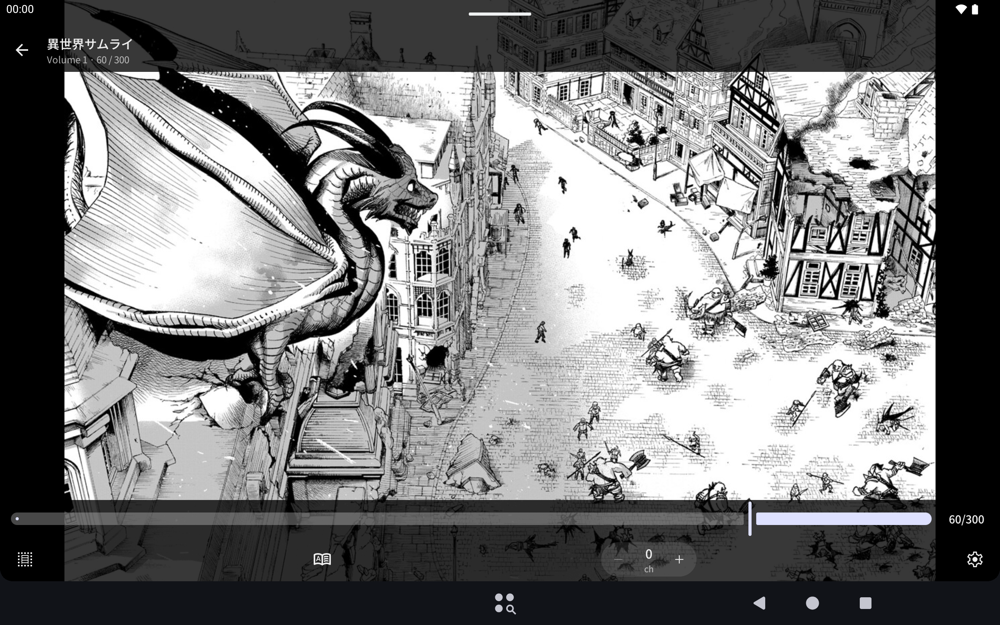

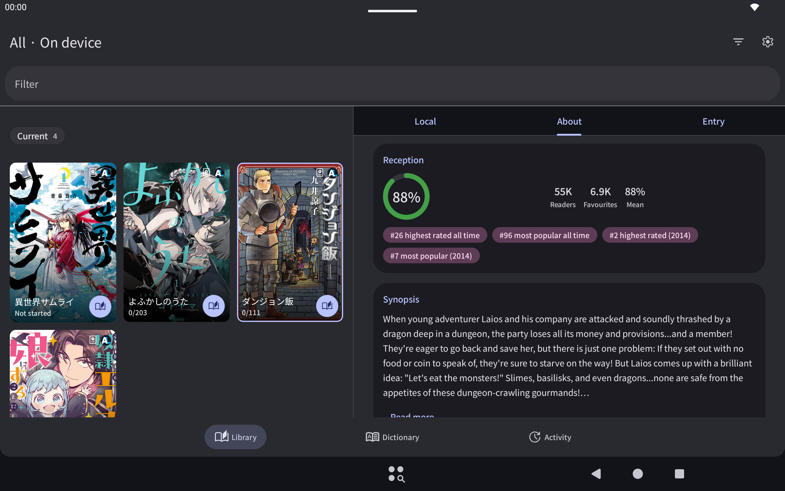

---

## Download

**[v1.0.0-beta](https://github.com/NOPNOP0F/yomime/releases/latest)**

Requires Android 8.0 or newer, and tested on Android versions 8.0, 11, 15, 16. On first run, dictionaries are downloaded from inside the app in the languages you choose.

This is a beta version. Bug reports, suggestions, and questions are all welcome.